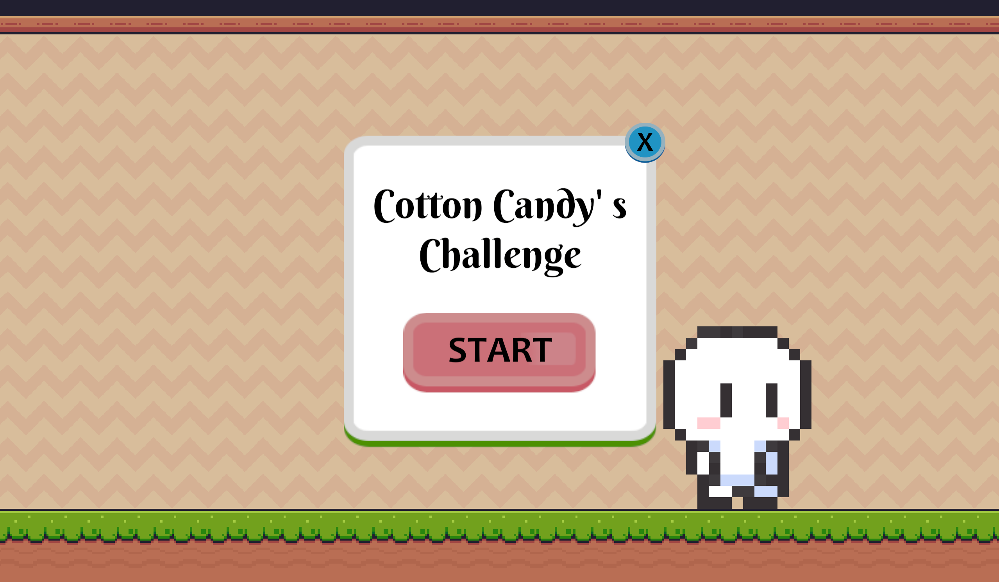
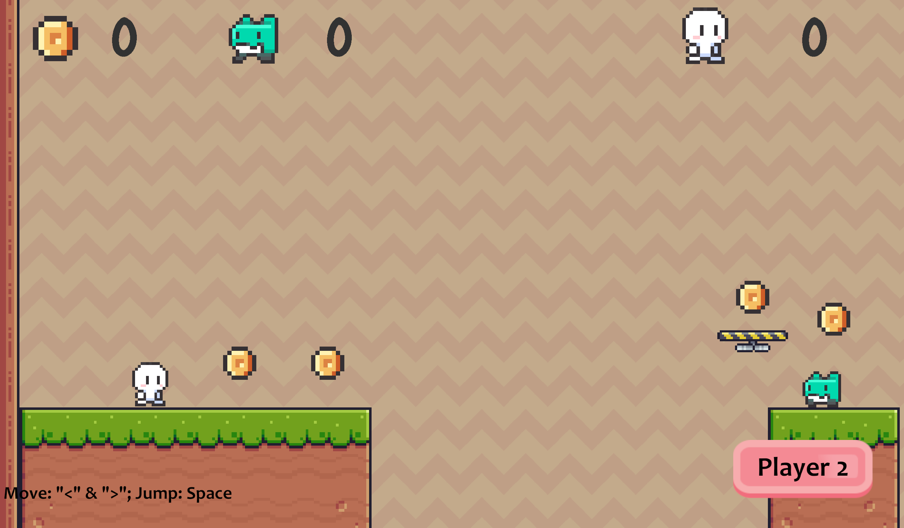
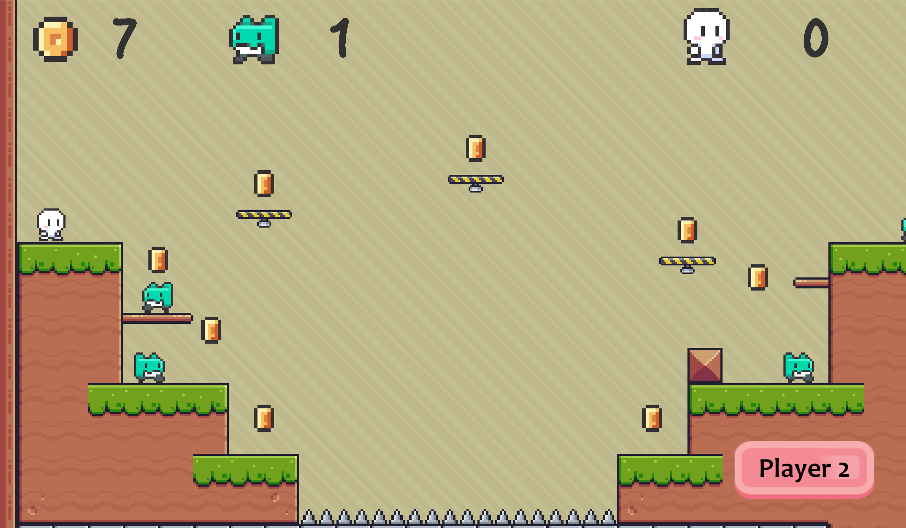
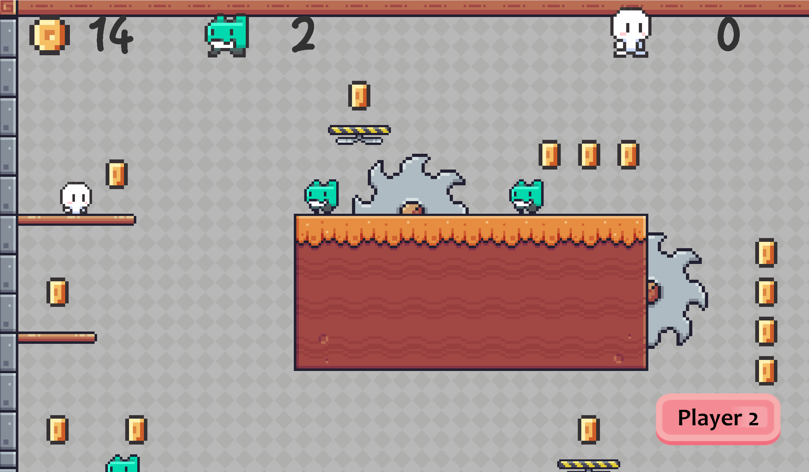
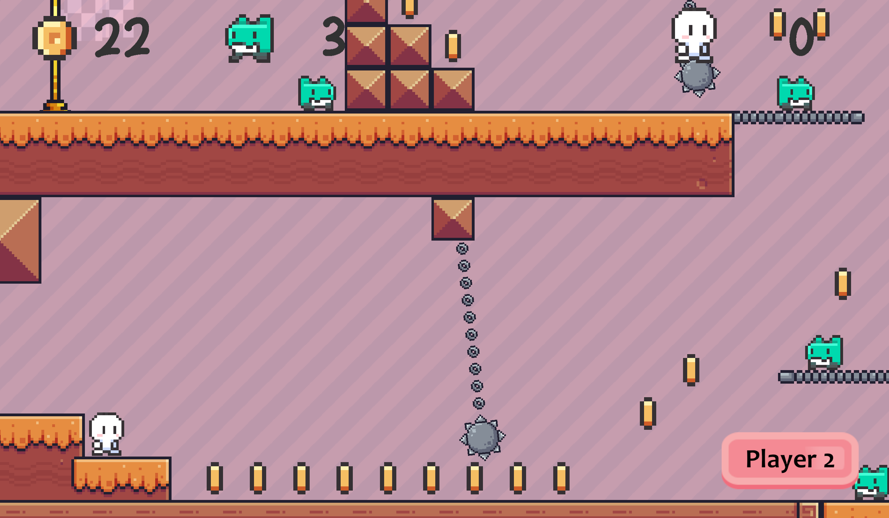
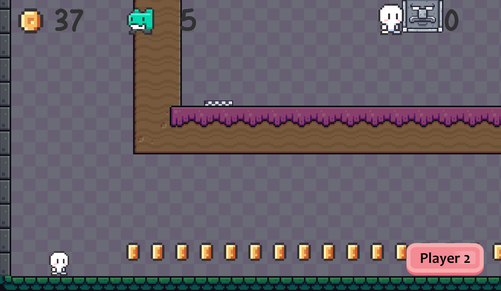
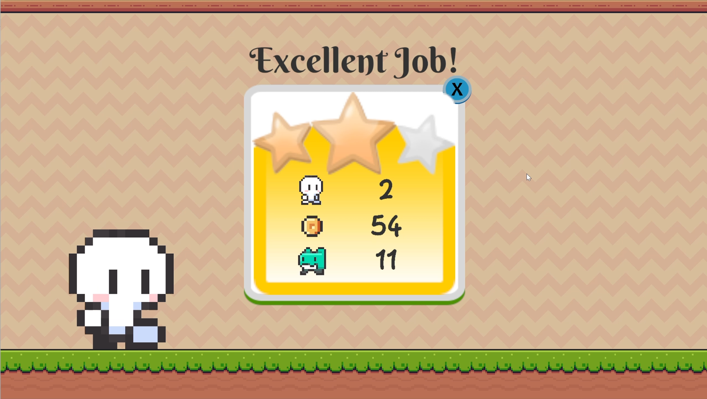

# CottonCandy

## Gameplay
- Use arrow keys to move, and the spacebar to jump.

## Game Scene
### Game Start

### Levels

### Game Over

## Build & Source Code
- Demonstration Video: https://youtu.be/_vgcpcpx14M
- WebGL Version Available (PC): https://yobisaboy.itch.io/cotton-candy
- Game Download: https://github.com/yobisaboy/CottonCandy
- Unity Project: https://github.com/yoyohohoh/comp305assignment2

## Contact
- Tel: +1 (647) 637-0831
- Email: hoyiuyiuyoyo@gmail.com
- LinkedIn: https://www.linkedin.com/in/yoyoho
- Portfolio: https://yobisaboy.github.io/Portfolio

